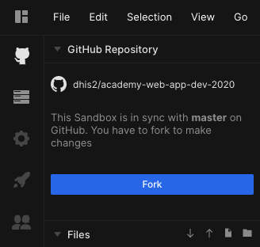
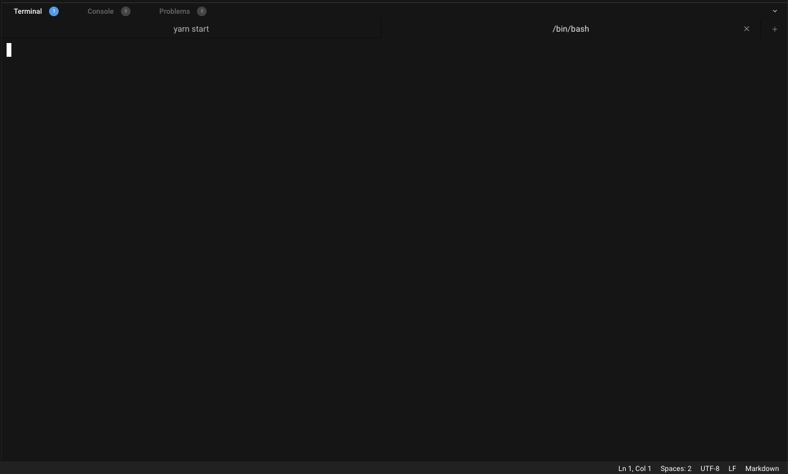
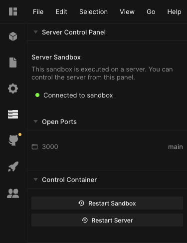
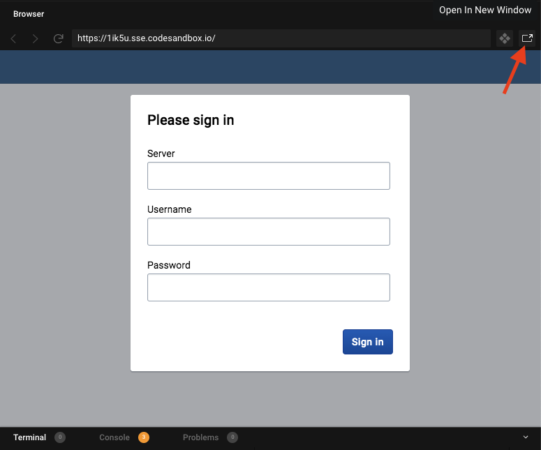
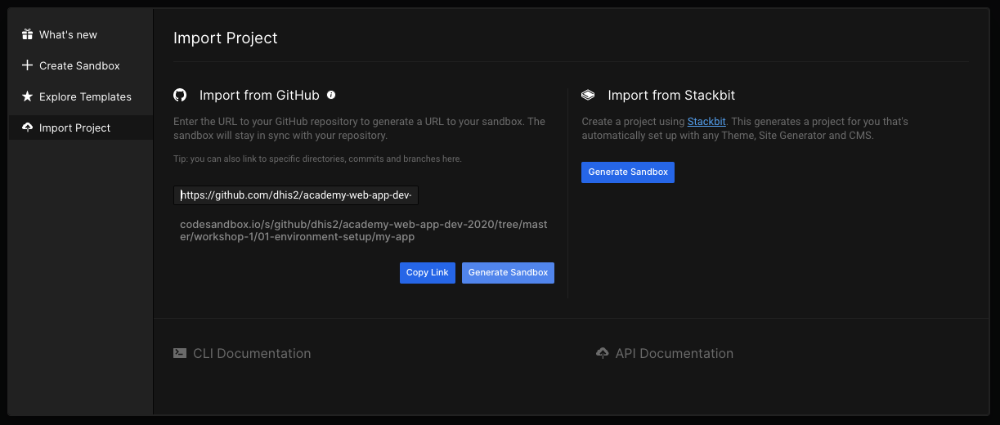

# CodeSandbox

The exercises in this workshop should all include links which will open the relevant code directory in CodeSandbox.  However, if you need to use this manually you can also [import a GitHub Project](#import-github).

Here are a few steps to follow every time you open a CodeSandbox project for this workshop:

- Once you've opened a CodeSandbox link (like [this one](https://github.com/dhis2/academy-web-app-dev-2020/tree/master/workshop-1/01-environment-setup/my-app)) you need to [fork the project](#fork-project) before you can edit it.
- Some tasks will require you to [open a terminal](#terminal) and run shell commands.
- If you want to view the application in the full browser (while still reloading when code changes) you can [show the app full-screen](#full-screen-app)

## Prerequisites
To use [CodeSandbox](https://codesandbox.io) for this academy, you will need to have a GitHub account, and login to code-sandbox using that account.

## Fork a CodeSandbox project
Once a project is running in CodeSandbox, it will be in read-only mode. In order to make any changes to the code you will have to fork the project. To do so, simply click on the blue button saying "Fork".

## Open a terminal window to issue commands
The panel that holds the terminal window is right at the bottom of the screen. If it is not visible at, you can click the icon in the bottom-right to expand that panel. The main terminal window is read-only, so you will have to open an additional one by clicking on the `+` icon on the right.

## Restarting the server
If you run into any issues, it might be useful to restart the server, or even the entire sandbox. To do so, first click on the "Server Control panel" tab on the left and then click on "Restart server" or "Restart sandbox".

## Show the app full-screen
By default the running app will be displayed in a panel within the CodeSandbox IDE. If you have limited screen dimensions, that might not be a convenient layout for you. An alternative would be to open the running app in separate browser window and reduce the size of the app panel dramatically:
- To open the app in a separate window, simply click the button on the top right of the preview window. Fun fact: this window will also auto-reload when you save changes to files.
- To create more space in the CodeSandbox IDE, you can simply resize the different panels to suite your needs by dragging their edges.

## Import a GitHub project

> Note: this shouldn't be necessary for the exercises in this workshop

Follow the steps below to open the project in CodeSandbox
1. In the left sidebar, navigate to "Overview" or "My sandboxes"
1. Click on "Create Sandbox"
1. In the modal, click on "Import project" and choose "Import from GitHub". You will now see an input for "GitHub repository URL"
1. The GitHub repo for this academy contains directories for workshops and exercises. Each exercise directory contains a starting point directory, and a `*-solution` directory.
1. The link to the first exercise is `https://github.com/dhis2/academy-web-app-dev-2020/tree/master/workshop-1/01-environment-setup/my-app`. You can paste this link into the input from step 3.
1. Now click "Generate Sandbox" to open the exercise in the CodeSandbox IDE.

